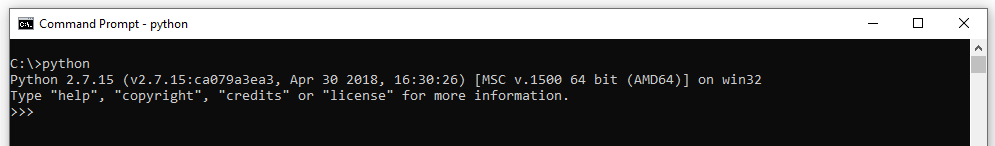

# Canadian-Oilfield-Envrionmental-Assessor
Repository for the Canadian Oilfield Environmental Assessor (COEA) tool  
  
The COEA tool relies on several datasets describing several activities of the upstream Canadian O&G industry. For access to this data, please contact the author - alexbradley60@gmail.com

# Requirements
Python version: Python 2.7  
**Dependant packages**
Numpy  
matplotlib  
CSV 
openpyxl   
shapely  
scipy  
pandas

# Instructions
**1) Python installation**   
The COEA is best using the command prompt (Windows) or terminal (Mac) on your local machine.
Python v2.7 is required and should be installed as follows - https://github.com/BurntSushi/nfldb/wiki/Python-&-pip-Windows-installation.
Following a successful implementation, you should be able to call python from your command prompt/terminal and see the following. You can exit the python shell by typing quit(). Ensure you have exited before progressing to the next instruction.

  

**2) Installing dependant packages**  
For the COEA to work, a number of dependant python packages must be installed. This can be achived using the python installation package (PIP) command in the terminal or command prompt. For example, to install the openpyxl package type "pip install openpyxl". Repeat the same command for the remaining packages listed above.

**3) Install git and copy this repository to your local machine**  
To run the code in the repository, you must download it to your local machine. The is most efficiently done through git ([What is git?](https://git-scm.com/book/en/v2/Getting-Started-What-is-Git%3F)), as you can continue to update your code if any changes are made.

